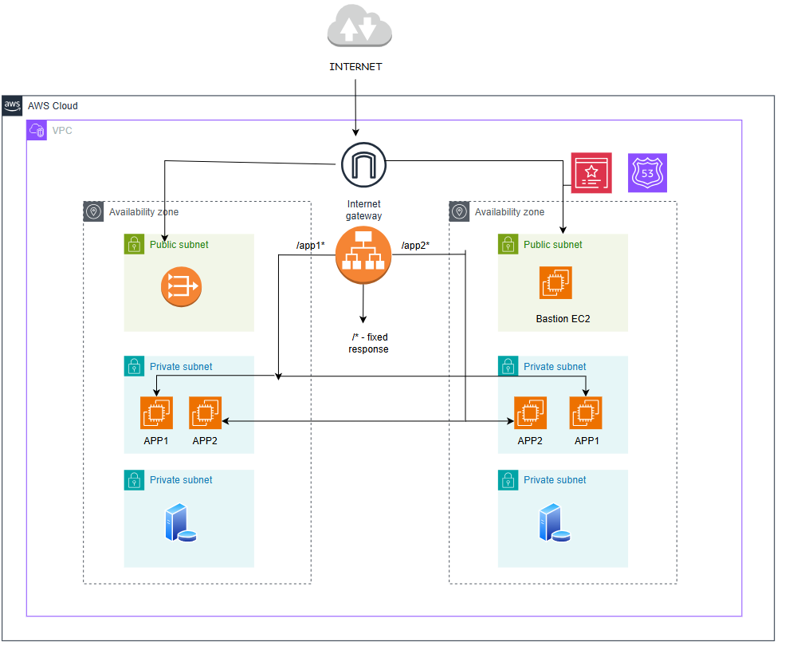

# **AWS ALB Context Path Routing using Terraform** 🛠️

## **Overview**
This project demonstrates how to implement context path-based routing in an **AWS Application Load Balancer (ALB)** using **Terraform**. The ALB routes traffic to different backend applications running on **EC2 instances**, based on specific URL path patterns. The solution ensures secure communication by incorporating **HTTPS redirection**, **SSL certificate management** via **AWS Certificate Manager (ACM)**, and **custom domain** management through **Route53**.

---

## **Key Features**
- 🌐 **Custom Domain Integration**:  
  - Manages DNS records using **AWS Route53** for a custom domain.  

- 🛡️ **Secure Communication**:  
  - Configures **SSL/TLS** certificates using **AWS Certificate Manager (ACM)** to enable HTTPS.  
  - Automatically redirects all HTTP traffic to HTTPS for enhanced security.

- 📂 **Context Path Routing**:  
  - Implements path-based routing using ALB listener rules:
    - `/*` returns a fixed response: for the custom domain 
    - `/app1*` routes traffic to EC2 instances running **App1**:    
    - `/app2*` routes traffic to EC2 instances running **App2**:  

- 🔧 **Scalable and Modular Architecture**:  
  - Deploys **EC2 instances** for each application in **private subnets** to ensure security.  
  - Uses **Terraform modules** for reusable and maintainable infrastructure code.

---

## **Technologies Used**
- **Terraform** – Infrastructure as Code (IaC) tool to automate the deployment.
- **AWS ALB (Application Load Balancer)** – Distributes incoming traffic based on path patterns.
- **Route53** – Manages DNS records for the custom domain.
- **EC2** – Hosts the backend applications.
- **ACM (AWS Certificate Manager)** – Provides SSL certificates for HTTPS.
- **VPC, Subnets, Security Groups** – Ensures network segmentation and security.

---

## **Architecture Diagram**


---

## **How to Run the Project**

Follow these steps to deploy the AWS ALB with context path routing using Terraform:

### **Prerequisites**
1. **Terraform** installed on your local machine ([Installation Guide](https://learn.hashicorp.com/tutorials/terraform/install-cli)).
2. **AWS CLI** installed and configured with appropriate credentials ([Configuration Guide](https://docs.aws.amazon.com/cli/latest/userguide/cli-configure-quickstart.html)).
3. A **Route53 domain** set up in your AWS account.

---

### **Steps to Deploy**

1. **Clone the repository**:
   ```bash
   git clone https://github.com/Chethana-22/Terraform_AWS_ALB.git
   cd terraformALB

2. **Initialize Terraform**:
  ```bash
  terraform init

This downloads the required provider plugins and initializes the working directory.

3. **Review the execution plan**:
  ```bash
  terraform plan

This command generates an execution plan, showing the resources that Terraform will create.

4. Apply the configuration:
  ```bash
  terraform apply

Type yes when prompted to confirm the resource creation.
Wait for Terraform to complete provisioning the resources.

5. Access the Applications
Once the deployment is complete, you can access the applications using the custom domain:

Fixed Response:
https://apps.customdomain.com
Returns a fixed response configured in ALB.

App1:
https://apps.customdomain.com/app1/index.html
Routes to EC2 instances hosting App1.

App2:
https://apps.customdomain.com/app2/index.html
Routes to EC2 instances hosting App2.

6. Cleanup
To delete the resources created by Terraform, run:
  ```bash
  terraform destroy